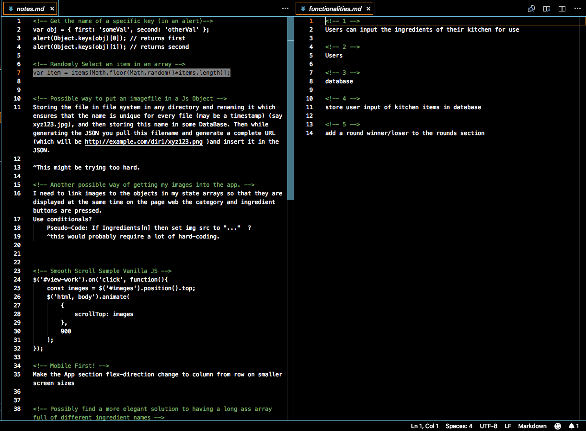

# CHOPPDT
---
## [Demo Video](https://youtu.be/uLNvlpdSDJE)

## What It Is
CHOPPDT is basically a simulation of the game-show, "Chopped", on The Food Network. It will generate a category at random for that players will use as the theme for whatever it is they wish to cook. Players will then recieve three ingredients which must be found in some capacity in whatever recipe they come up with. 

## Author
* Jalani Paul


## What was Used
* React.js
* HTML5
* CSS3
* Scrollaable Anchor, a 3rd Party React module

## App Walkthrough

<h2> *Home Screen* </h2>
The home screen that users arrive at when launching the application
<p align='center'>
    
</p>

<h2> *UI* </h2>
Users land on the title page of the application and click, "GET COOKIN'" to begin utilizing the primary content.

On the left side of the application is where users will generate a random categpry from a database of catergories stroed in the state of the main component. Next, they will use the right side of the application to generate three random ingredients in the same fashion. 
As "CHOPPED" the show operates on a round system, users will have the option to save the ingredients they've generated in the space provided below the ingredient/category component.

<h2> *UX* </h2>
 

### GET COOKIN' 
Users will click the button provided on the landing page to be redirected to the main app content. 

### SET INGREDIENTS 
On the left, users will find a button that will randomly generate a category from a datbase of categories saved within the state of the main app component. Users will based their recipes around the theme of the category that has been generated


### SET CATEGORIES 
On the right, users will find a button that will randomly generate three ingredients saved within the state of the main app component. Users will use the generated ingredient in whatever recipes they decide to concoct.


### SET ROUNDS 
After the ingredients are ranomly generated, users will be smoothly redirected to the section towards the bottom where there are three separate rounds displayed. So that they can remember what the ingredients were for each round, they can hit the "SET ROUND" button found in each section to save the most recently generated set of ingredients to a particular round section. Users will be smoothly scrolled back upwards after setting the round so that they may generate another three ingredients for the folowwing round.
Setting the ingredients for one round section will not clear the ingredients out of any other round section. Users may shuffle between categories and ingredients as often as they like and may update the ingredients per round as often as they like.


## Challenges
<p align='center'>
    </img>
</p>

### Challeneges
Beign that this was my first project made after learning how to use React, most of my frustrations came from reaching roadblocks that went beyond my skills and logic as a developer and required a bit of research into specific, particular syntax that React requires.
The largest challenge over the course of development involved trying to properly get images to display that had indiviual path's referenced in the state. The components that render the random categories and ingredients can also render pictures in addition to names. Despite the correct relative path displaying in the src attribute in the img tags, the images wouldn't display at all. It was then that I had reached out for help and was led to the idea of importing each of my images directly to the app, storing them in a variable and then referecning that variable in the state rather than using the path as a string.
<br>

### Layout & Positioning
The layout for the landing page was inspired by a design that I had found on CodePen.io and reformatted using flexbox and a react library that adds a smooth scrolling react component.
The main app components were styled using flexbox as well.


### Using State as a Database (Category Section)

```javascript
 categories:[
        
        {name: "Sandwiches!", img:sandwiches},
        {name: "MAKE. IT. SPICY.", img:spicy},
        {name: "Would A Small Child Like This?", img:smallchild},
        {name: "Wok This Way (Wok Mandatory)", img:wok},
        {name: "MAKE. IT. SWEET.", img:sweet},
        {name: "Gotta Grill It!", img:grill},
        {name: "Soups", img:soup},
        {name: "Healthy-Eats", img:healthy},
        {name: "Breakfast", img:breakfast}
      ],

      selectedCategories:[
        {name:"", img:""}
      ],
}
```


</p>

### Future Features
<ul>
<li>User Authentication</li>
<li>Switch from state-database to a back-end database</li>
<li>Users update the databse with items from their pantry</li>
<li>Users upload and save pictures of recipes they've created</li>
<li>Sleeker, more modernized app interface</li>
<li></li>
<li></li>
</ul>
