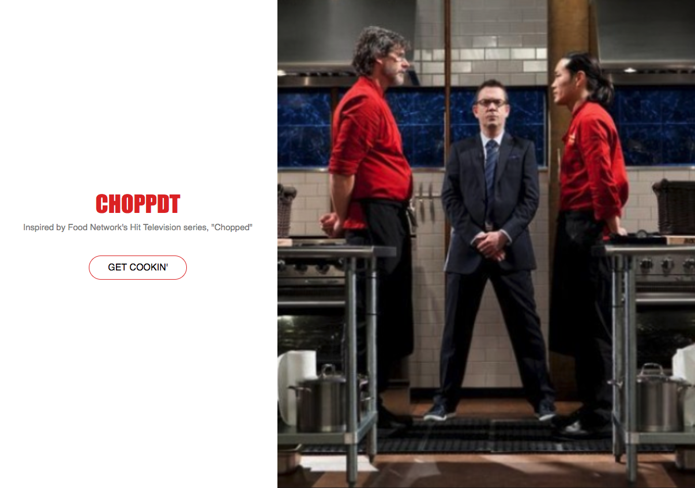

# CHOPPDT
---
## [Demo Video](https://youtu.be/uLNvlpdSDJE)

## What It Is
CHOPPDT is basically a simulation of the game-show, "Chopped", on The Food Network. It will generate a category at random for that players will use as the theme for whatever it is they wish to cook. Players will then recieve three ingredients which must be found in some capacity in whatever recipe they come up with. 

## Author
* Jalani Paul


## What was Used
* React.js
* HTML5
* CSS3
* Scrollaable Anchor, a 3rd Party React module

## App Walkthrough

<h2> *Home Screen* </h2>
The home screen that users arrive at when launching the application
<p align='center'>
    
</p>

<h2> *UI* </h2>
Users land on the title page of the application and click, "GET COOKIN'" to begin utilizing the primary content.

On the left side of the application is where users will generate a random categpry from a database of catergories stroed in the state of the main component. Next, they will use the right side of the application to generate three random ingredients in the same fashion. 
As "CHOPPED" the show operates on a round system, users will have the option to save the ingredients they've generated in the space provided below the ingredient/category component.

<h2> *UX* </h2>
 

### GET COOKIN' 
Lorem ipsum dolor sit amet, consectetur adipiscing elit, sed do eiusmod tempor incididunt ut labore et dolore magna aliqua. Ut enim ad minim veniam, quis nostrud exercitation ullamco laboris nisi ut aliquip ex ea commodo consequat. Duis aute irure dolor in reprehenderit in voluptate velit esse cillum dolore 

### SET INGREDIENTS 
Lorem ipsum dolor sit amet, consectetur adipiscing elit, sed do eiusmod tempor incididunt ut labore et dolore magna aliqua. Ut enim ad minim veniam, quis nostrud exercitation ullamco laboris nisi ut aliquip ex ea commodo consequat. Duis aute irure dolor in reprehenderit in voluptate velit esse cillum dolore 


### SET CATEGORIES 
Lorem ipsum dolor sit amet, consectetur adipiscing elit, sed do eiusmod tempor incididunt ut labore et dolore magna aliqua. Ut enim ad minim veniam, quis nostrud exercitation ullamco laboris nisi ut aliquip ex ea commodo consequat. Duis aute irure dolor in reprehenderit in voluptate velit esse cillum dolore 


### SET ROUNDS 
Lorem ipsum dolor sit amet, consectetur adipiscing elit, sed do eiusmod tempor incididunt ut labore et dolore magna aliqua. Ut enim ad minim veniam, quis nostrud exercitation ullamco laboris nisi ut aliquip ex ea commodo consequat. Duis aute irure dolor in reprehenderit in voluptate velit esse cillum dolore 


## Challenges
<p align='center'>
    </img>
</p>

### Challeneges
Lorem ipsum dolor sit amet, consectetur adipiscing elit, sed do eiusmod tempor incididunt ut labore et dolore magna aliqua. Ut enim ad minim veniam, quis nostrud exercitation ullamco laboris nisi ut aliquip ex ea commodo consequat. Duis aute irure dolor in reprehenderit in voluptate velit esse cillum dolore 
<br>

### Layout & Positioning
Lorem ipsum dolor sit amet, consectetur adipiscing elit, sed do eiusmod tempor incididunt ut labore et dolore magna aliqua. Ut enim ad minim veniam, quis nostrud exercitation ullamco laboris nisi ut aliquip ex ea commodo consequat. Duis aute irure dolor in reprehenderit in voluptate velit esse cillum dolore 


```javascript
This function uses the browser's built-in geolocation features
function getCurrentLocation() {
  var position = navigator.geolocation;
  if (position) {
    navigator.geolocation.getCurrentPosition(position => {console.log(position);});
  } else {
    console.log('"Geolocation is not supported by this browser.');
  }
}
``` This function uses Google's Geolocation API
function getGeolocationDataAndDoStuff(stuffToDo) {
  const GEOLOCATION_BASE_URL = 'https://www.googleapis.com/geolocation/v1/geolocate?'
  $.get(GEOLOCATION_BASE_URL, {
        key: GEOLOCATION_API_KEY,
        considerIp: true
    })
    .then(stuffToDo)
    .catch(error => {
      console.log(error);
    });
}```


### Google Places Autocomplete search
Another of the functions of the website that we would like to use if we were to move forward with the application would be auto-complete address with partial data(i.e. 123 Spoo = 123 Spooner St Quahog, RI. Lisa was able to write the code for this but the GeoCode API was not working up to our standards. Below is the code:

```javascript
function getGeocodeDataAndDoStuff(address, stuffToDo, stuffYouNeed=null) {
  $.get(GEO_BASE_URL, {
        address: address,
        key: GEO_API_KEY})
    .then(data => {
      stuffToDo(data, stuffYouNeed);
    })
    .then(data => {
      if (data.results[1]) {createAddressSelectList(data.results);}
      })
    .catch(error => {
      console.log(error);
  });
}```


```javascript
function createAddressSelectList(data) {
  var $asc = $(ADDR_SELECT_CONTAINER);
  var $ul = $('<ul>');
  data.forEach(result => {
    var formattedAddress = result.formatted_address;
    var $li = $('<li>');
    var $a = $('<a>');
    $a.text(formattedAddress);
    $a.attr('href', '#');
    $li.on('click', event => {
      event.preventDefault();
      $asc.text('');
      $(ADDRESS_INPUT).attr('value', formattedAddress);
      someFunctionSimilarToSubmitRequest(formattedAddress)
    });
    $a.appendTo($li);
    $li.appendTo($ul);
  });
  $ul.appendTo($asc);
}
```
</p>

### Future Features
<ul>
<li></li>
<li></li>
<li></li>
<li></li>
<li></li>
<li></li>
<li></li>
</ul>
